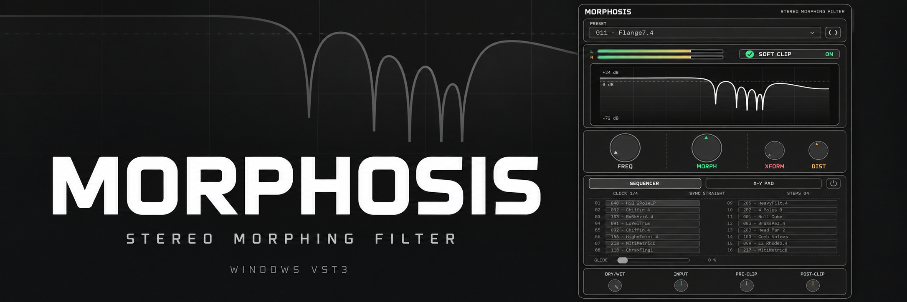

# MORPHOSIS



Windows x64 VST3 implementation of a seven-stage morphing filter using 289
recovered cube records. The filter behavior is an engineering approximation,
not a bit-exact hardware emulation.

Without a preset WAV export from a hardware unit, the stored preset settings
cannot be recovered, so preset emulation cannot be brought closer yet. This
affects largely Xform, gain and dist positions for .4 distortion enabled 
presets. Filter cubes are fully implemented.


## Build

Requirements: CMake 3.22 or newer, Visual Studio with the MSVC C++ toolchain
and Windows SDK. JUCE 7.0.12 is included in `third_party/JUCE`; configuration
does not download dependencies or use another workspace.

```powershell
cmake -S . -B build -G "Visual Studio 18 2026" -A x64 -DBUILD_TESTING=ON
cmake --build build --config Release --parallel 8
ctest --test-dir build -C Release --output-on-failure
```

For a different installed Visual Studio version, choose its CMake generator.
The VST3 bundle is produced at
`build/Morphosis_artefacts/Release/VST3/MORPHOSIS.vst3`. The build does not
install it; install the complete `.vst3` bundle when ready to test in a DAW.

## Layout

- `src/`: plugin, DSP, embedded cube data, preset taxonomy, and UI.
- `tests/`: automated regression tests and the reference fixture.
- `assets/fonts/`: the two IBM Plex Mono faces embedded in the editor.
- `docs/design/`: approved portrait UI concept and preview.
- `third_party/JUCE/`: pinned JUCE 7.0.12 source, including its license.

The current target is Windows VST3 only. Sequencer and X-Y blending are part
of the plugin; the preset source WAVs, research scripts, historical build
trees, and old legacy plugin are not required to build this repository.
See [provenance](docs/PROVENANCE.md) and
[third-party notices](docs/THIRD_PARTY.md).

No license is granted for the MORPHOSIS project code or recovered preset
data by this repository. Decide the intended distribution terms and review
source-data rights before publishing a public remote.
